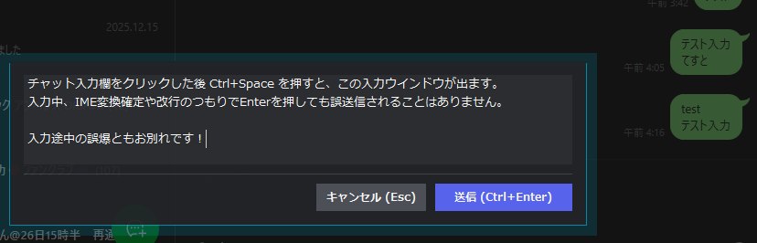

# 🛡️ X-Ops-SafetyEnter
**チャットアプリの「Enter誤爆」を物理的に根絶するステルスHUDオーバーレイ**

## 🇯🇵 日本語 (Japanese)

Discord、LINE、Slack、Teamsなどのデスクトップ版チャットアプリで、 **「日本語の変換を確定しようとしてEnterを押したら、変換途中の恥ずかしいテキストが誤送信されてしまった」** という経験はありませんか？

X-Ops-SafetyEnterは、対象アプリの上に専用の「ステルス入力HUD」を展開することで、この問題を100%確実に防ぐWindows用ユーティリティです。

### 💡 なぜこのツールが必要なのか？（技術的な背景）
最近のチャットアプリ（Electron製アプリなど）とWindowsのIME（TSF）の仕様上、外部ツールから「現在、日本語変換中かどうか」を正確に判定してEnterキーの挙動を制御することは極めて困難です。
本ツールは「見えない壁」と戦うのをやめ、**「安全な独立した入力欄（HUD）を最前面に呼び出し、そこで入力を完結させてからアプリに転送する」**という逆転の発想で、誤爆の可能性を物理的にゼロにしました。

### ✨ 主な機能と特徴
* **🛡️ 完璧な誤送信防止**: HUD内ではEnterキーは常に「改行」として機能します。変換確定のEnterが送信に化けることは絶対にありません。
* **⚡ ステルスUX**: `Ctrl + Space` でスッと入力枠が現れ、`Ctrl + Enter` を押した瞬間にテキストが対象アプリへペーストされ、自動で送信されます。
* **🚑 究極のフェイルセーフ（虚無撃ち対策）**: 送信時、万が一対象のアプリがアクティブでなかった場合でも、入力したテキストは改行を含めて**クリップボードに自動保存**されます。手動で `Ctrl + V` を押すだけで1秒でリカバリー可能です。長文が消え去る絶望とは無縁です。
* **🎯 アプリの追加・除外が簡単**: 任意のアプリをアクティブにして `Ctrl + Shift + E` を押すだけで、HUDの有効/無効を簡単に切り替えられます（モダンなトースト通知付き）。

### 🚀 インストールと使い方

#### 導入方法
1. **[Releases]** ページから最新の `X-Ops-SafetyEnter.exe` をダウンロードします。
2. 任意のフォルダに配置し、ダブルクリックで起動します。（常駐アプリとしてタスクトレイに格納されます）
   *(※ソースコードから実行する場合は、[AutoHotkey v2](https://www.autohotkey.com/v2/) をインストールし、`X-Ops-SafetyEnter.ahk` を実行してください)*

#### 基本操作（ショートカットキー）
| キー操作 | アクション |
| :--- | :--- |
| `Ctrl + Space` | 対象アプリ上で**入力HUDを呼び出す** |
| `Enter` (HUD内) | 安全に**改行**する（変換確定も通常通り） |
| `Ctrl + Enter` | 対象アプリにテキストを**転送して送信**し、HUDを閉じる |
| `Esc` (HUD内) | 入力を**キャンセル**してHUDを閉じる（テキストは保持されます） |
| `Ctrl + Shift + E` | アクティブなアプリを対象グループに**追加 / 除外**する |

#### デフォルトの対象アプリ
初回起動時、自動的に以下のアプリが対象として設定されます（`settings.ini` が生成されます）。
* Discord (`Discord.exe`)
* LINE (`LINE.exe`)
* Slack (`slack.exe`)
* Microsoft Teams (`Teams.exe`)

---

## 🇺🇸 English

**A Stealth HUD Overlay to 100% prevent accidental message sends in desktop chat apps.**

Have you ever accidentally sent an incomplete message while typing or converting text (especially with CJK IMEs) in chat apps like Discord, LINE, Slack, or Teams? **X-Ops-SafetyEnter** solves this by providing a dedicated, floating "Stealth HUD" input field over your chat apps.

Instead of fighting the complex input handling of Electron-based apps, this tool physically isolates your typing environment. You draft your message safely in the HUD, and hit `Ctrl+Enter` to instantly paste and send it to the target app.

### ✨ Key Features
* **Zero Accidental Sends**: The `Enter` key in the HUD strictly performs line breaks (or IME confirmations). You can only send intentionally via `Ctrl+Enter`.
* **Clipboard Fail-safe**: If the target app loses focus and the send fails, your drafted text (including line breaks) is automatically kept in your clipboard. Just press `Ctrl+V` to recover it instantly. No more lost paragraphs.
* **Smart Toggle**: Press `Ctrl+Shift+E` on any application to easily add or remove it from the tool's target list, complete with a modern toast notification.

### 🚀 Usage
1. Download `X-Ops-SafetyEnter.exe` from the **[Releases]** page and run it. (Or run the `.ahk` script using AutoHotkey v2).
2. Focus on a target chat app (e.g., Discord) and press `Ctrl + Space` to summon the Stealth HUD.
3. Type your message safely. Press `Enter` for line breaks.
4. Press `Ctrl + Enter` to send the message to the chat app.

### ⌨️ Hotkeys
* `Ctrl + Space` : Summon the Input HUD
* `Ctrl + Enter` : Send message (from within the HUD)
* `Esc` : Hide the HUD (input text is preserved for recovery)
* `Ctrl + Shift + E` : Toggle target status for the currently active window

---
**Disclaimer**: This tool uses standard Windows clipboard and keystroke sending methods. It does not access the internet or collect any personal data.
